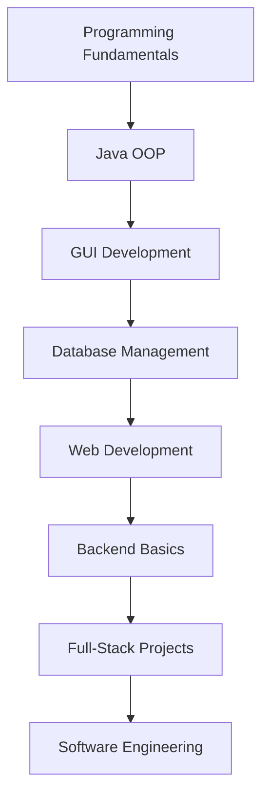

<div align="center">


# -ˋˏ もしもし, I'm HsiReyak13! ˎˊ-


<br><br>


</div>

---

<div align="center">


</div>

---

## ✦ About Me

> 🎓 IT student focusing on programming, system development, and design  
> 💻 Aspiring developer who enjoys building clean and useful projects  
> 🌱 Currently learning Java, web development, databases, and UI/UX  
> 🎨 Passionate about user-friendly interfaces and simple digital experiences  
> 🚀 Always improving through projects, practice, and curiosity  

```java
public class HsiReyak13 {
    String role = "IT Student";
    String dream = "Professional Software Developer";
    String focus = "Clean, useful, and user-friendly systems";

    String[] interests = {
        "Java Development",
        "Web Development",
        "UI/UX Design",
        "Database Management",
        "System Design",
        "Technology and Innovation"
    };

    void motto() {
        System.out.println("Code. Learn. Build. Improve.");
    }
}
```

---

## ✦ Tech Stack

<div align="center">

### Languages


<br><br>

### Tools & Platforms


<br><br>

### Currently Exploring


</div>

---

## ✦ Programming Languages

| Language | What I Use It For |
|---|---|
| Java | OOP, desktop apps, school projects, system development |
| Python | Scripting, automation, logic practice |
| JavaScript | Web interactivity and frontend logic |
| TypeScript | Cleaner and safer JavaScript |
| HTML | Website structure |
| CSS | Styling, layout, animation, and responsive design |
| C | Programming fundamentals |
| C++ | Problem solving and structured programming |
| C# | Application development exploration |
| PHP | Basic backend web development |

---

## ✦ GitHub Stats

<div align="center">


</div>

---

## ✦ Most Used Languages

<div align="center">


</div>

---

## ✦ GitHub Trophies

<div align="center">


</div>

---

## ✦ GitHub Summary

<div align="center">


<br><br>


<br><br>


</div>

---

## ✦ Contribution Activity

<div align="center">


</div>

---

## ✦ Skills Progress

```txt
Java OOP          ████████░░  80%
HTML & CSS        ███████░░░  70%
JavaScript        ██████░░░░  60%
Database Design   ██████░░░░  60%
UI/UX Design      ███████░░░  70%
Git & GitHub      ██████░░░░  60%
Problem Solving   ███████░░░  70%
Documentation     ███████░░░  70%
Debugging         ██████░░░░  60%
```

---

## ✦ Current Learning Path



---

## ✦ Projects I Like Building

| Project Type | Description |
|---|---|
| Library Systems | Book borrowing, returning, and management |
| Reservation Systems | Booking and scheduling systems |
| Food Ordering Systems | Kiosk-style menu and ordering apps |
| Inventory Systems | Product and stock management |
| Student Management Systems | Student records, grades, and profiles |
| Web Apps | Responsive and interactive websites |
| UI/UX Prototypes | Clean and user-friendly layouts |
| Educational Apps | Tools that support students and learning |

---

## ✦ Featured Projects

<div align="center">

<a href="https://github.com/HsiReyak13/REPOSITORY-NAME-1">
  
</a>

<a href="https://github.com/HsiReyak13/REPOSITORY-NAME-2">
  
</a>

</div>

> Replace `REPOSITORY-NAME-1` and `REPOSITORY-NAME-2` with your real repository names.

---

## ✦ Development Workflow

```txt
01. Understand the problem
02. Plan the features
03. Design the interface
04. Write clean code
05. Test and debug
06. Improve the user experience
07. Document the project
08. Upload and maintain it on GitHub
```

---

## ✦ Random Dev Quote

<div align="center">


</div>

---

## ✦ Contribution Snake

<div align="center">


</div>

> The snake animation needs a GitHub Action workflow to generate `snake.svg`.

---

## ✦ Pacman Contribution Graph

<div align="center">

<picture>
  <source media="(prefers-color-scheme: dark)" srcset="https://raw.githubusercontent.com/HsiReyak13/HsiReyak13/output/pacman-contribution-graph-dark.svg">
  <source media="(prefers-color-scheme: light)" srcset="https://raw.githubusercontent.com/HsiReyak13/HsiReyak13/output/pacman-contribution-graph.svg">
  
</picture>

</div>

> The Pacman graph also needs a GitHub Action workflow to generate it.

---

## ✦ Connect With Me

<div align="center">

<a href="https://github.com/HsiReyak13">
  
</a>

<a href="mailto:your-email@example.com">
  
</a>

<a href="https://www.linkedin.com/in/your-linkedin">
  
</a>

</div>

---

<div align="center">


</div>


